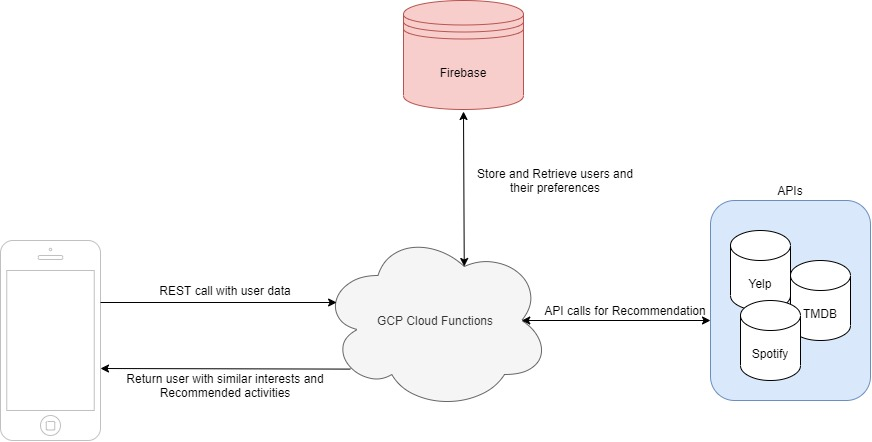

[Front-end Repository](https://github.com/christinetrac/uofthacks-friendle-frontend)

# UofTHacks Tech writeup

## Description
Quarantining alone is hard. Choosing fun things to do is even harder. 
We built an app that matches you with other people and suggests virtual-friendly hangout ideas based on our AI algorithm 🤝💖

## Front-end
We used React Native to build a native iOS app!

[Insert Figma here]

## Back-end

### Demo
We have a publicly available REST API!
You can make a POST request to our endpoint to get recommended quarantine activities anywhere, anytime 😊

e.g.
`curl  -d '{"username":"achoo2","location":"toronto,ca","mbti":"entp","music":["kpop"],"movies":["action"],"food":["sushi"]}' -H 'Content-Type: application/json' '	https://recgate-1g9rdgr6.uc.gateway.dev/rec'
`

### Architecture

We chose to use a serverless framework (Google Cloud Functions) that scales automatically so we can save costs and make our service always accessible for our users. We used GCP's API Gateway to host our API (written in Python3) and integrated Firebase to persist user information for later retrieval. 

### Algorithm
In order to match users, we encoded the user preferences into a vector to compute similarity scores with users. We tried to pair the user that was closest in terms of spacial score (using a nearest neighbor algorithm). After retrieving a match, we mapped various preferences into keywords and queried the Spotify/Yelp/TMDB APIs to generate some interesting activities that the pair might enjoy! 

### Distributed Computing
We chose to use the [Distributed Computer](https://dcp.dev/) to parallelize our similarity scoring between users. By batching up our pairs of user-vector combinations and distributing them across the DCP network, we were able to reduce computation time needed by around 70%. Our problem fit the DCP nicely since each combination's similarity is able to be computed without needing information about the other pairs.
